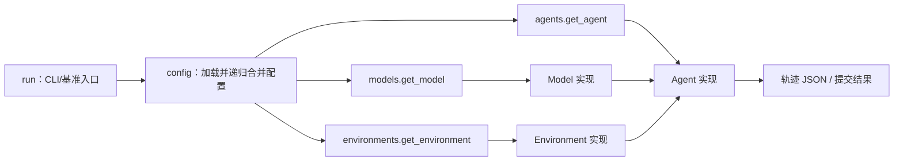
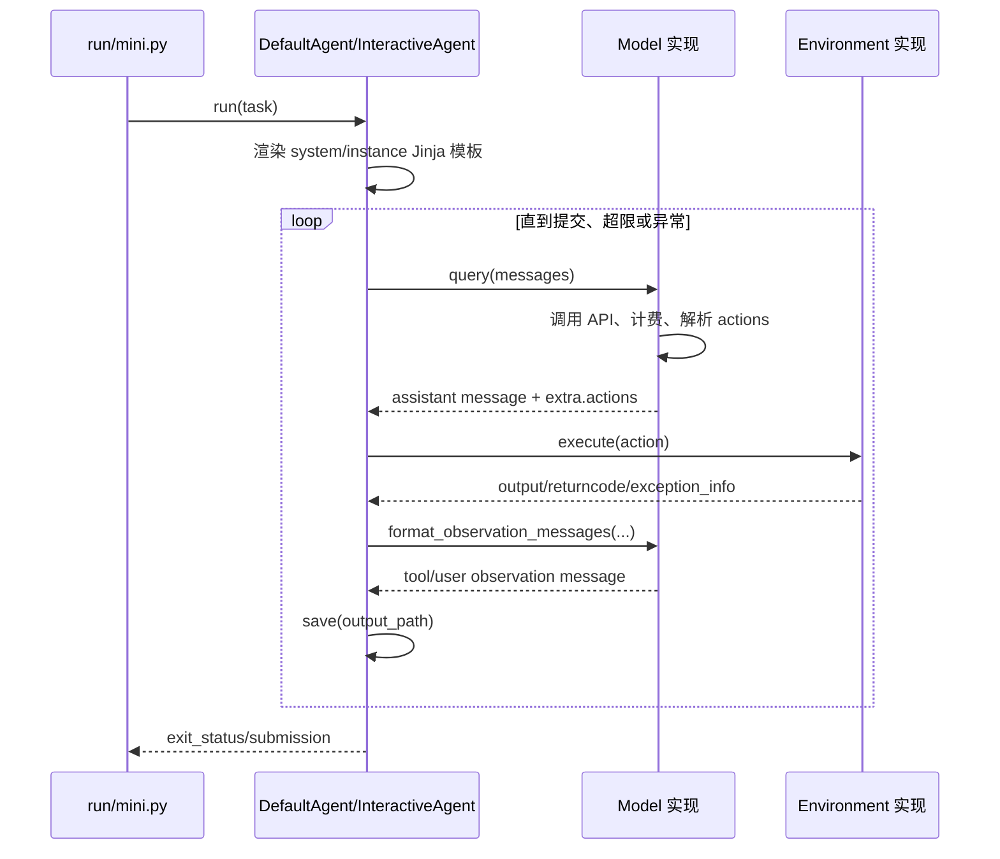

# `src` 目录架构与文件职责分析

本文基于 `src/` 当前源码编写，分析 `mini-SWE-agent` 的分层方式、主要调用链，以及目录内各文件的职责。分析对象包括 74 个非缓存文件；`__pycache__`、空的 `mini_swe_agent.egg-info` 等自动生成目录单独说明。

## 1. 项目定位

`mini-SWE-agent` 是一个强调“小、简单、可读”的软件工程智能体框架。它把一个完整智能体拆成三个可替换组件：

- **Agent**：控制对话循环、限制、消息历史、动作执行和轨迹保存。
- **Model**：调用语言模型，把模型回复解析为可执行动作，并把执行结果转换回模型能理解的消息。
- **Environment**：在本机、容器或远程沙箱中执行动作。

`run` 层负责选择并组装上述组件；`config` 层通过 YAML 和命令行覆盖项提供配置；`utils` 层放置跨模块复用的基础能力。

## 2. 总体目录结构

```text
src/
├── minisweagent/                 # 主 Python 包
│   ├── agents/                   # 智能体控制循环与交互模式
│   ├── config/                   # 内置 YAML 配置及配置解析
│   ├── environments/             # 本地、容器和远程执行环境
│   ├── models/                   # 模型提供商/API 协议适配
│   ├── run/                      # CLI 入口、基准运行器和轨迹工具
│   ├── utils/                    # 日志、递归配置合并等通用工具
│   ├── __init__.py               # 全局路径、版本和核心 Protocol
│   ├── __main__.py               # python -m minisweagent 入口
│   ├── exceptions.py             # 控制智能体流程的异常体系
│   └── py.typed                  # PEP 561 类型信息标记
└── mini_swe_agent.egg-info/      # 当前为空的安装元数据目录
```

这是标准的 **src-layout**：Python 包位于 `src/minisweagent`，可以避免开发时意外从仓库根目录导入未安装的源码。

## 3. 核心架构关系

### 3.1 组件关系



三类组件都通过 `minisweagent/__init__.py` 中的 `Protocol` 约定最小接口。工厂函数既接受内置短名称，也接受完整的 Python 导入路径，因此用户可以在包外实现自定义组件。

### 3.2 一次任务的主执行链



任务完成不是普通返回，而是环境在检测到输出首行为 `COMPLETE_TASK_AND_SUBMIT_FINAL_OUTPUT` 后抛出 `Submitted`。该异常继承自 `InterruptAgentFlow`，由 Agent 循环转成一条 `role=exit` 消息并结束运行。

### 3.3 配置覆盖顺序

配置通常按以下优先级从低到高递归合并：

1. 内置 YAML 配置；
2. 后续 `-c/--config` 指定的 YAML 或 `a.b=value` 配置项；
3. CLI 独立参数，例如 `--model`、`--cost-limit`、`--environment-class`。

`UNSET` 是“不要覆盖已有配置”的哨兵值。`recursive_merge` 会忽略它，因此 CLI 参数未传入时不会用 `None` 或空值破坏 YAML 默认值。

## 4. 分层设计分析

### 4.1 Agent 层

`DefaultAgent` 实现最小自动循环，`InteractiveAgent` 继承它并加入人工确认、人工命令和模式切换。核心状态包括消息历史、模型调用次数、实例成本、连续格式错误次数和运行开始时间。

Agent 只依赖 `Model` 与 `Environment` 协议，不依赖具体提供商或沙箱。新增模型或环境通常不需要修改 Agent。

### 4.2 Model 层

Model 层有两个维度：

| 提供商/客户端 | Chat Completions 工具调用 | Responses API | 纯文本动作 |
|---|---|---|---|
| LiteLLM | `litellm_model.py` | `litellm_response_model.py` | `litellm_textbased_model.py` |
| OpenRouter | `openrouter_model.py` | `openrouter_response_model.py` | `openrouter_textbased_model.py` |
| Portkey | `portkey_model.py` | `portkey_response_model.py` | 无 |
| Requesty | `requesty_model.py` | 无 | 无 |

三个动作协议分别由 `actions_toolcall.py`、`actions_toolcall_response.py`、`actions_text.py` 统一解析和格式化。这样提供商类主要负责 HTTP/SDK 调用、成本计算和响应结构适配。

### 4.3 Environment 层

| 环境 | 执行位置 | 主要用途 |
|---|---|---|
| Local | 当前主机 | 本地开发、快速试用 |
| Docker | 本机 Docker/Podman 容器 | 默认隔离执行、SWE-bench |
| Singularity | 本机 Singularity/Apptainer 沙箱 | HPC/无 Docker 场景 |
| Bubblewrap | Linux 非特权沙箱 | 轻量实验性隔离 |
| SWE-ReX Docker | Docker + SWE-ReX | 使用统一远程执行抽象 |
| SWE-ReX Modal | Modal 云沙箱 | 远程并行评估 |
| ConTree | ConTree 容器服务 | 远程容器会话执行 |

各实现返回统一的 `output`、`returncode`、`exception_info` 字段，并实现相同的任务提交检测逻辑。

### 4.4 Run 层

Run 层分三类：

- `mini.py`、`hello_world.py`：普通任务入口；
- `benchmarks/`：SWE-bench 和 ProgramBench 单实例/批量评估；
- `utilities/`：全局配置管理、轨迹检查器、额外命令分发。

安装后的主要命令为 `mini`、`mini-swe-agent` 和 `mini-extra`。`python -m minisweagent` 也会进入 `mini` 应用。

## 5. 每个文件的功能

### 5.1 包根目录 `src/minisweagent/`

| 文件 | 功能 |
|---|---|
| `__init__.py` | 定义版本号；确定包目录与用户全局配置目录；创建并加载 `.env`；导出日志器；定义 `Model`、`Environment`、`Agent` 三个核心 `Protocol`。导入包时还会输出版本和配置路径，除非设置 `MSWEA_SILENT_STARTUP`。 |
| `__main__.py` | `python -m minisweagent` 的入口，直接调用 `run/mini.py` 中的 Typer 应用。 |
| `exceptions.py` | 定义控制流异常：`Submitted` 表示任务提交，`LimitsExceeded`/`TimeExceeded` 表示资源限制，`UserInterruption` 表示人工中断，`FormatError` 表示模型动作格式不合法。异常可携带待追加到轨迹的消息。 |
| `py.typed` | 空的 PEP 561 标记文件，声明安装包对外提供可用的内联类型注解。 |

### 5.2 Agent 模块 `src/minisweagent/agents/`

| 文件 | 功能 |
|---|---|
| `__init__.py` | Agent 工厂。维护 `default`、`interactive` 短名称映射，支持完整导入路径；深拷贝配置后实例化指定 Agent。 |
| `default.py` | 定义 `AgentConfig` 与 `DefaultAgent`。负责 Jinja 模板渲染、消息维护、模型查询、动作执行、步数/成本/墙钟时间限制、格式错误恢复、异常轨迹记录、序列化与 JSON 轨迹保存，是整个系统的核心控制循环。 |
| `interactive.py` | `DefaultAgent` 的人工参与扩展。提供 `human`、`confirm`、`yolo` 三种模式，打印对话，支持危险动作确认、退出确认、用户追加任务、Ctrl+C 中断和 `/y`、`/c`、`/u`、`/m`、`/h` 斜杠命令。 |
| `README.md` | 简要说明默认 Agent 与交互 Agent 的定位。 |
| `utils/__init__.py` | Agent 工具子包标记，当前不导出公共符号。 |
| `utils/prompt_user.py` | 基于 `prompt_toolkit` 的交互输入辅助模块。延迟创建单行/多行 `PromptSession`，保存输入历史，并检测真实 TTY，避免在 CI、重定向输入、Git Bash/MSYS 等环境中错误启动交互终端。 |

### 5.3 配置模块 `src/minisweagent/config/`

| 文件 | 功能 |
|---|---|
| `__init__.py` | 配置查找与解析。依次从显式路径、`MSWEA_CONFIG_DIR`、内置配置目录及其 `extra`、`benchmarks` 子目录寻找 YAML；支持把 `model.model_kwargs.temperature=0` 解析成嵌套字典。 |
| `default.yaml` | `DefaultAgent` 的通用配置，包含系统/任务提示词、本地环境变量、观察结果截断模板与格式错误提示。步数和成本限制默认为关闭。 |
| `mini.yaml` | `mini` CLI 的默认交互配置。使用 `confirm` 模式、3 美元实例成本限制、JSON 风格观察结果，并要求模型通过原生 `bash` 工具调用执行动作。 |
| `mini_textbased.yaml` | 面向旧式纯文本动作协议的交互配置，提示模型在名为 `mswea_bash_command` 的三反引号代码块中给出动作；通常应与 text-based Model 类配置组合使用。 |
| `inspector.tcss` | Textual 轨迹检查器的界面样式，定义主容器、滚动区、消息头、消息正文、推理区、Header 和 Footer 的布局与颜色。 |
| `README.md` | 简要列出默认、mini 和 SWE-bench 配置用途。 |
| `benchmarks/__init__.py` | 基准配置子包标记，无运行逻辑。 |
| `benchmarks/swebench.yaml` | SWE-bench 默认配置：Docker `/testbed` 环境、250 步、3 美元限制、原生并行工具调用、默认 Claude Sonnet 模型，以及适配代码修复任务的提示词。 |
| `benchmarks/swebench_backticks.yaml` | SWE-bench 的三反引号纯文本动作变体，从名为 `mswea_bash_command` 的代码块提取命令，适合不稳定或不支持原生工具调用的模型。 |
| `benchmarks/swebench_xml.yaml` | SWE-bench 的 XML 动作变体，通过 `<mswea_bash_command>...</mswea_bash_command>` 解析命令；默认配置 OpenRouter 上的 MiniMax 模型。 |
| `benchmarks/swebench_modal.yaml` | 增量覆盖配置，应与 `swebench.yaml` 合并；把执行环境改为 SWE-ReX Modal 云沙箱，并把模型切换为 Portkey 的 `gpt-5-mini`。 |
| `benchmarks/programbench.yaml` | ProgramBench 默认配置。使用 Docker `/workspace`、较长容器/任务超时、1000 步和无成本上限，包含面向长周期软件构建任务的提示词和输出模板。 |

### 5.4 Environment 模块 `src/minisweagent/environments/`

| 文件 | 功能 |
|---|---|
| `__init__.py` | Environment 工厂。注册 `docker`、`singularity`、`local`、`swerex_docker`、`swerex_modal`、`bubblewrap`、`contree` 短名称，并支持完整导入路径。 |
| `local.py` | 直接在当前主机运行 shell 命令。自定义 `_run` 在超时时终止整个 POSIX 进程组，统一捕获命令输出，并检测提交标志。 |
| `docker.py` | 用 Docker/Podman CLI 启动长生命周期容器，再通过 `exec` 执行命令。支持环境变量转发、自定义解释器/运行参数、拉取超时、工作目录和析构清理。 |
| `singularity.py` | 把镜像构建成可写 Singularity 沙箱后执行命令；支持构建重试、环境变量、全局参数、执行参数和临时沙箱清理。 |
| `README.md` | 概述 Local、Docker、Singularity 和部分 extra 环境的用途。 |
| `extra/__init__.py` | 实验/可选 Environment 子包标记，无运行逻辑。 |
| `extra/bubblewrap.py` | Linux 实验性 Bubblewrap 环境。创建独立临时工作目录，以只读方式挂载系统目录并隔离 `/tmp`、`/proc`、`/dev`，执行完后清理工作目录。 |
| `extra/contree.py` | 使用 `contree-sdk` 拉取 OCI 镜像、创建持久会话并执行命令；支持镜像认证、环境转发、自动创建工作目录，并把 SDK 数据类异常信息写入统一输出。 |
| `extra/swerex_docker.py` | 使用 SWE-ReX `DockerDeployment` 管理 Docker 运行时，通过异步 API 执行命令并同步包装给 Agent。 |
| `extra/swerex_modal.py` | 使用 SWE-ReX `ModalDeployment` 创建远程 Modal 沙箱，支持启动/运行/部署超时、环境变量、pipx 安装和 Modal 沙箱参数，并提供带超时的停止逻辑。 |

### 5.5 Model 模块 `src/minisweagent/models/`

| 文件 | 功能 |
|---|---|
| `__init__.py` | 模型工厂和全局统计器。按“显式参数 → 配置 → `MSWEA_MODEL_NAME`”解析模型名；映射各种模型类；为 Anthropic 系列默认开启缓存控制；线程安全地累计全局成本和调用次数并执行全局限制。 |
| `litellm_model.py` | 默认模型适配器。通过 LiteLLM Chat Completions 调用多种提供商，使用原生 `bash` 工具调用，处理 Anthropic thinking 块、缓存控制、多模态内容、重试、成本计算和响应持久化。 |
| `litellm_response_model.py` | LiteLLM Responses API 变体。将历史 response 对象展平为无状态 input 项，解析扁平 `function_call`，并输出 `function_call_output` 观察消息。 |
| `litellm_textbased_model.py` | LiteLLM 纯文本动作变体。不向 API 传 tools，而是用正则从模型文本中的专用代码块提取恰好一个命令。 |
| `openrouter_model.py` | 直接通过 HTTP 调用 OpenRouter Chat Completions，使用原生工具调用；处理认证/限流/API 异常、OpenRouter usage 成本、缓存控制和多模态消息。 |
| `openrouter_response_model.py` | OpenRouter Responses API 变体。调用 `/api/v1/responses`，展平完整历史，解析 response output 中的函数调用。 |
| `openrouter_textbased_model.py` | OpenRouter 纯文本动作变体。不传 tools，使用正则提取专用代码块命令。 |
| `portkey_model.py` | 使用 `portkey-ai` Chat Completions SDK 与原生工具调用。支持 API key/virtual key/provider，借助 LiteLLM 注册表和 token usage 计算成本，并修正 Portkey 缓存 token 统计差异。 |
| `portkey_response_model.py` | Portkey Responses API 无状态变体。把历史 response 展平，解析 `function_call`，产生 `function_call_output`，并使用 LiteLLM 计算成本。 |
| `requesty_model.py` | 直接通过 HTTP 调用 Requesty Chat Completions；使用原生工具调用和 Requesty 响应中的 `usage.cost`，定义认证、限流和通用 API 异常。 |
| `test_models.py` | 确定性测试模型集合。按预置顺序返回文本、Chat 工具调用或 Responses API 消息，支持模拟异常、等待、警告和固定调用成本，供测试 Agent 流程而不访问真实 API。 |
| `README.md` | 模型接口简述，指出 LiteLLM 是默认且覆盖面最广的实现。 |
| `extra/__init__.py` | 可选 Model 子包标记，无运行逻辑。 |
| `extra/roulette.py` | 元模型实现：`RouletteModel` 每次随机选择一个子模型，`InterleavingModel` 按轮询或指定索引序列选择子模型。 |

### 5.6 Model 工具 `src/minisweagent/models/utils/`

| 文件 | 功能 |
|---|---|
| `__init__.py` | Model 工具子包标记，当前不统一导出符号。 |
| `actions_text.py` | 旧式文本动作协议：用正则提取恰好一个命令；失败时构造 `FormatError`；把环境输出渲染为普通 user observation。 |
| `actions_toolcall.py` | Chat Completions 工具调用协议：定义 `bash` 工具 JSON Schema，校验工具名和参数，转换为动作，并按 `tool_call_id` 生成 tool 观察消息。 |
| `actions_toolcall_response.py` | Responses API 工具调用协议：定义扁平工具 Schema，兼容对象/字典响应，识别 token 截断原因，解析 `function_call` 并生成 `function_call_output`。 |
| `anthropic_utils.py` | 调整 Anthropic assistant 消息中的 `thinking`/`redacted_thinking` 内容块顺序；纯 thinking 消息会补空文本块以满足 API 要求。 |
| `cache_control.py` | 深拷贝消息并管理 Anthropic 风格的 `cache_control: ephemeral`，当前 `default_end` 模式只在最后一条消息设置缓存点。 |
| `content_string.py` | 把传统文本、多模态、Anthropic tool use/result、OpenAI tool calls 和 Responses API output 统一提取为适合终端展示的字符串。 |
| `openai_multimodal.py` | 按正则识别文本中的多模态标记，把 `image_url` 等内容转换成 OpenAI 风格结构化内容块，且不修改原对象。 |
| `retry.py` | 对 Tenacity 的薄封装。重试次数由 `MSWEA_MODEL_RETRY_STOP_AFTER_ATTEMPT` 控制，采用 4～60 秒指数退避，并排除认证等不可恢复异常。 |

### 5.7 Run 模块 `src/minisweagent/run/`

| 文件 | 功能 |
|---|---|
| `__init__.py` | 运行入口子包标记，无业务逻辑。 |
| `hello_world.py` | 最小 Python API/CLI 示例：组装 `DefaultAgent + LitellmModel + LocalEnvironment`，读取 `default.yaml` 的 Agent 配置并执行任务。 |
| `mini.py` | 默认 `mini` CLI。完成首次配置、合并 YAML/键值/CLI 配置、必要时交互读取任务，然后通过三个工厂组装 Model、Environment、InteractiveAgent 并保存轨迹。 |
| `README.md` | 简要说明本地运行入口和扩展命令。 |
| `extra/__init__.py` | 额外运行入口预留子包，当前为空。 |

### 5.8 基准运行器 `src/minisweagent/run/benchmarks/`

| 文件 | 功能 |
|---|---|
| `__init__.py` | 基准入口子包标记，无运行逻辑。 |
| `swebench_single.py` | 单实例 SWE-bench CLI。加载指定数据集和 split，按 ID 或排序后的索引选择实例，合并配置，构建对应镜像环境并运行交互 Agent。 |
| `swebench.py` | SWE-bench 批量运行器。映射常用数据集，计算实例镜像名，执行环境启动命令，筛选/切片/固定种子打乱实例，用线程池并行运行，保存每实例轨迹、`preds.json`、日志和退出状态报告。 |
| `programbench.py` | ProgramBench 批量运行器。为每个实例选择镜像、运行长周期 Agent、从容器复制 `/workspace` 为 `submission.tar.gz`，保存精简轨迹，并通过线程池并发处理。 |
| `utils/__init__.py` | 基准工具子包标记，无运行逻辑。 |
| `utils/common.py` | 定义 `ProgressTrackingAgent`，在 `DefaultAgent.step()` 前把当前步数和成本报告给批处理进度管理器。 |
| `utils/batch_progress.py` | 线程安全的 Rich 批处理 UI。显示总体进度、单实例状态、退出状态统计、全局模型成本和 ETA，并持续写入 YAML 汇总报告。 |

### 5.9 运行工具 `src/minisweagent/run/utilities/`

| 文件 | 功能 |
|---|---|
| `__init__.py` | 运行工具子包标记，无业务逻辑。 |
| `config.py` | `mini-extra config` 子命令。首次运行时交互设置默认模型/API key；支持设置、删除、编辑全局 `.env`，修改后立即重新加载。 |
| `mini_extra.py` | `mini-extra` 中央命令分发器。按第一个参数延迟导入并转交给 config、inspect、swebench、swebench-single、programbench Typer 应用。 |
| `inspector.py` | Textual 轨迹浏览器。递归查找 `*.traj.json`，把消息分组成步骤，支持步骤/轨迹导航、滚动、推理显示切换、热重载、命令面板，以及用 `jless` 查看当前步骤或完整轨迹。 |

### 5.10 通用工具 `src/minisweagent/utils/`

| 文件 | 功能 |
|---|---|
| `__init__.py` | 通用工具子包标记，无统一导出。 |
| `log.py` | 初始化名为 `minisweagent` 的 Rich 控制台日志器，并提供向根日志器追加普通文件日志处理器的函数。 |
| `serialize.py` | 定义 `UNSET` 哨兵与 `recursive_merge`。后出现的字典优先，嵌套字典递归合并，所有层级的 `UNSET` 都被过滤。 |

## 6. 自动生成目录和文件

### `__pycache__/` 与 `*.pyc`

这些是 CPython 导入模块后生成的字节码缓存，不属于业务源码。当前可见的缓存分布在包根、`agents`、`agents/utils`、`config`、`environments`、`models`、`models/utils`、`run`、`run/utilities` 和 `utils` 下。它们可以安全地重新生成，通常应由 `.gitignore` 排除。

### `src/mini_swe_agent.egg-info/`

这是 setuptools/pip 在可编辑安装或构建过程中生成的包元数据目录。当前目录为空，不参与运行逻辑；正常情况下也应视为构建产物。

## 7. 关键数据结构

### 消息

轨迹以 `messages: list[dict]` 保存。常见字段为：

| 字段 | 含义 |
|---|---|
| `role` / `type` | system、user、assistant、tool、exit 或 Responses API 项类型 |
| `content` / `output` | 模型文本、工具调用或工具结果 |
| `extra.actions` | 从模型响应解析出的统一动作列表，核心字段为 `command` |
| `extra.cost` | 本次模型调用成本 |
| `extra.response` | 原始提供商响应，用于调试和复现 |
| `extra.exit_status` | Submitted、LimitsExceeded、TimeExceeded 等退出原因 |
| `extra.submission` | 最终提交内容，SWE-bench 中通常是 Git patch |

### 环境执行结果

```text
{
  "output": "标准输出与标准错误的合并文本",
  "returncode": 0,
  "exception_info": "",
  "extra": { ... 可选异常详情 ... }
}
```

### 轨迹文件

`DefaultAgent.serialize()` 生成的轨迹主要包含：

- `info.model_stats`：实例成本与 API 调用次数；
- `info.config`：Agent、Model、Environment 的实际配置与实现类型；
- `info.exit_status`、`info.submission`：运行结果；
- `messages`：完整对话及动作/观察历史；
- `trajectory_format`：当前为 `mini-swe-agent-1.1`。

## 8. 主要扩展点

1. **新增 Agent**：实现 `run()`、`save()`，或继承 `DefaultAgent` 覆盖 `query()`、`step()`、`execute_actions()`；通过完整导入路径或 `_AGENT_MAPPING` 使用。
2. **新增 Model**：实现 `query()`、消息格式化、观察格式化、模板变量和序列化接口；需要确保格式错误时仍把成本和原始响应写入异常消息。
3. **新增 Environment**：实现统一 `execute()` 返回结构、模板变量和序列化；如果沿用当前提交协议，还需识别 `COMPLETE_TASK_AND_SUBMIT_FINAL_OUTPUT`。
4. **新增运行方式**：在 `run/` 中编写 Typer 入口，明确选择 Agent、Model、Environment；如需暴露到 `mini-extra`，在 `mini_extra.py` 注册子命令。
5. **新增配置变体**：创建 YAML，通过从左到右的 `-c` 合并实现小范围覆盖，无须复制整个配置。

## 9. 架构特点总结

- **优点**：核心循环短小；组件通过协议解耦；配置、实现和运行入口职责清晰；模型动作协议被抽成复用工具；单实例与批处理共用 Agent 能力；轨迹包含足够的复现信息。
- **代价**：多个 Environment 中的执行结果和提交检测逻辑存在重复；多个模型提供商适配器也重复了查询、成本、错误持久化和序列化流程，这是保持各类简单直接所付出的维护成本。
- **设计取向**：项目明显偏向“少抽象、易阅读”，并通过工厂、Protocol、配置递归合并这三个小型机制获得可扩展性，而不是构建复杂的依赖注入或插件框架。
